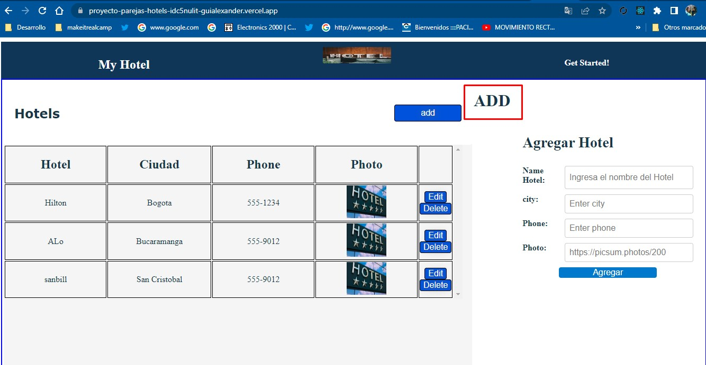

# Make It Real - CRUD couples project 

A web application will be developed that allows to carry out the basic operations of the CRUD (Create, Read, Update and Delete) using React and Express. The application will store the data in memory on the backend side and will have a REST API for CRUD operations.

## Table of contents

## Table of contents

- [Overview](#overview)
  - [The challenge](#the-challenge)
  - [Screenshot](#screenshot)
- [My process](#my-process)
  - [Built with](#built-with)
  - [What I learned](#what-i-learned)
  - [Continued development](#continued-development)
  - [Useful resources](#useful-resources)
- [Author](#author)
- [Acknowledgments](#acknowledgments)


## Overview :
-The first project in pairs is created for the Make It Real Fullstack Top bootcamp, a web application will be developed that allows basic CRUD operations (Create, Read, Update and Delete) using React and Express. The app will store the data in memory on the backend side and will have a REST API for CRUD operations.

The application will have a simple and intuitive user interface that allows users to interact with the application and perform CRUD operations without difficulty.

The project will be divided into several stages, starting with the planning and design of the application, followed by the implementation of the user interface and REST API, and finally the implementation of CRUD operations and deployment to production.

### The challenge
-It began in stages, the first stage was the design of the layout page, then we installed react and how to work with the components, we divided the components and integrated them with the main page.

then the api for the interface was built.### Screenshot




## My process

With this project we made great progress in teamwork, how to integrate the api with react , to create the api url we created it in render , and verser for the DOM

### Built with

-express
-javascript
-cors()
-DOM
-REACT
-express.json()

### What I learned


We learned how to work on a project in react with use State, useEffect, components, creating an ordered api, git teamwork.

we leave part of the api example:

```js
app.get('/api/hotels', handleGetAllData)

  function handleGetAllData(req, res) {
    console.log('Middleware Controller')
    const records = getAllData()
  
    return res.json(records)
  }

  function getAllData() {
  const records = table.findAll()

  return records
}

```

### Continued development
- I will continue practicing to have a better handling of DOM, studying and consulting my mentors so that every day I improve my knowledge. about react how to handle events and improve the code as the best practice way.

 ### Useful resources
- https://classroom.makeitreal.camp/courses/82/topics/353/progress -- This helped me I will use it in the future.
-https://www.semrush.com/blog/http-status-codes/?kw=&cmp=LM_SRCH_DSA_Blog_EN&label=dsa_pagefeed&Network=g&Device=c&utm_content=622526966308&kwid=dsa-1754723155433&cmpid=18364824154&agpid=146618527572&BU=Core&extid=60109657981&adpos=&gclid=Cj0KCQjw0tKiBhC6ARIsAAOXutmpFVwz9Xxe2-UA05kprXEYyPtDN1_lJg_RVv-DwILp4hj596HnYBwaAtvDEALw_wcB
-https://expressjs.com/en/resources/middleware/cors.html

## Author

- Miguel Chaparro
- Guillemro Alexander Herrera

## Acknowledgments

-I want to thank the make it real family since it has given me a new vision of my working life to improve and get out of the comfort zone and know that we can give more than what we already know
